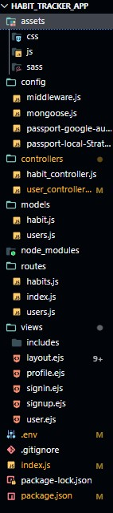

# Habit_tracker

A habit tracker offers a structured approach to creating, tracking, and improving habits. It allows you to set Clear Goals and visualize 
Progress and also add habits in your favourite lists.

Tech Stacks-Node.js,Express.js,MongoDB,Noty Messages,Passport-google-oauth

